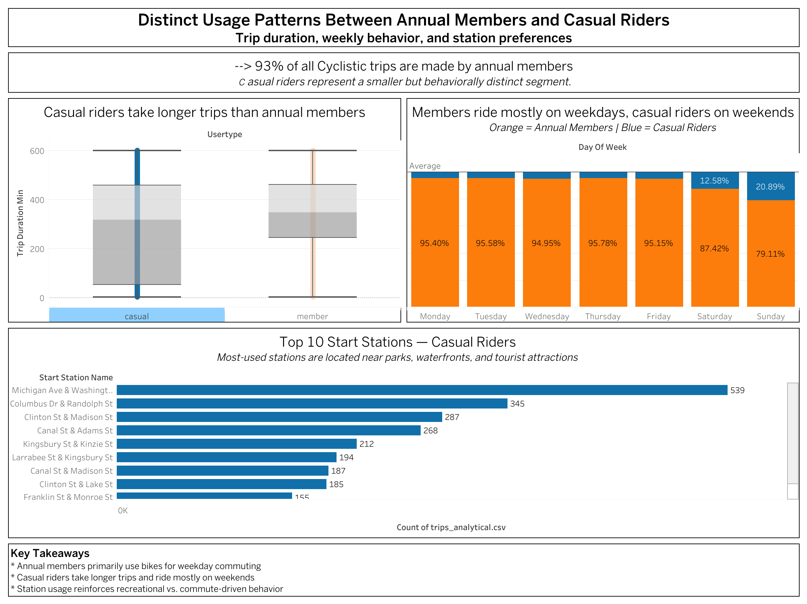

# Cyclistic Bike-Share Analysis

## Overview

This case study analyzes how annual members and casual riders use Cyclistic's bike-share service differently. The analysis looks at trip duration, usage patterns throughout the week, and preferred start stations to identify insights that can support membership growth.

## Business Question

How do annual members and casual riders use Cyclistic differently, and how can these insights support strategies to increase membership?

## Analysis

The analysis followed a structured data analysis process, including:

- Data preparation and cleaning
- Data type and consistency checks
- Standardization of user types across datasets
- Trip duration analysis
- Usage patterns by day of the week
- Analysis of the most frequently used start stations
- Data visualization and interpretation

The analysis combined Cyclistic trip data from 2019 and 2020. After cleaning and harmonizing the datasets, the analytical dataset contained 746,635 trips.

## Key Findings

- Annual members accounted for approximately 93% of the trips in the analytical dataset.
- Members showed more consistent usage throughout the week, particularly on weekdays.
- Casual riders had a higher proportion of trips on weekends, suggesting more recreational use.
- Casual riders were more likely to start trips near tourist attractions and recreational areas, while members more often used stations in business districts and central urban areas.
- Trip duration also differed between the two user groups.

These patterns suggest that members and casual riders use the service for different purposes and at different times.

## Business Recommendations

Based on the findings, the analysis recommends:

- Positioning membership as a convenient option for incorporating cycling into everyday transportation.
- Using targeted digital marketing to reach potential members, particularly younger audiences.
- Promoting membership plans at stations frequently used by casual riders, especially in recreational and high-traffic areas.

## Dashboard

The interactive Tableau dashboard presents the main findings of the analysis.

[Explore the interactive Tableau dashboard on Tableau Public](https://public.tableau.com/app/profile/vanessa.negreiros/viz/Cyclistic_Bike_Share_Usage_Patterns/Painel1)

## Deliverables

- [Executive Case Study](Business%20Analytics%20Case%20Study.pdf)
- [Full Case Study](Cyclistic%20Bike-Share%20Case%20Study.pdf)

## Tools

- R
- RStudio
- tidyverse
- janitor
- skimr
- lubridate
- ggplot2
- Tableau
